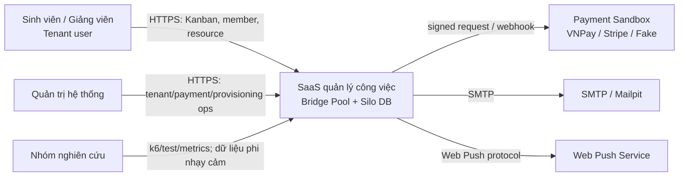
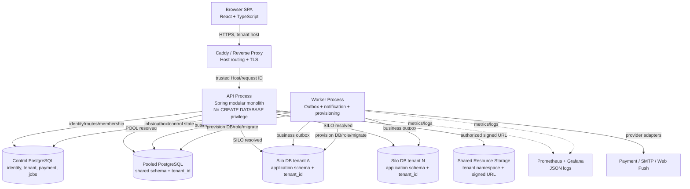
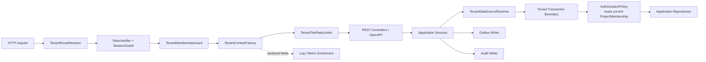
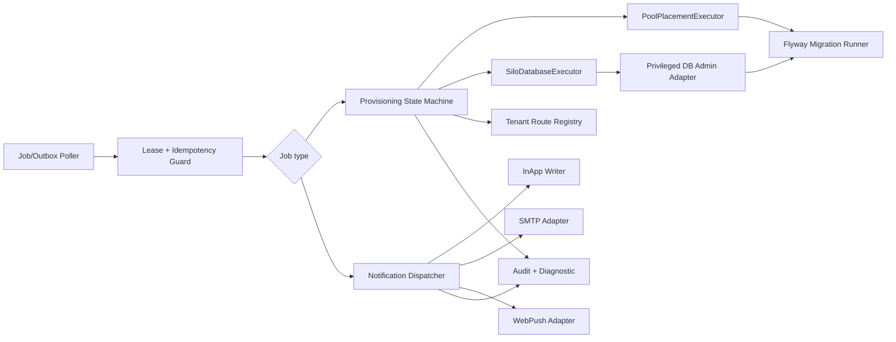

# C4 — Context, Container và Component

Mermaid dùng ký pháp flowchart portable; chú thích `TB` là trust boundary.

## 1. System Context

## 2. Container

## 3. API component

## 4. Worker/provisioning component

## 5. Quy tắc biên

- Browser, provider callback và forwarded headers đều là dữ liệu không tin cậy.
- Chỉ proxy được cấu hình mới cung cấp trusted forwarding headers; API tự xác minh host allowlist.
- API và worker dùng database principals khác nhau; chỉ provisioning adapter có quyền quản trị DB.
- Control DB không join trực tiếp application DB; storage không tự quyết authorization.
- Observability là đường egress dữ liệu: phải redact và giới hạn cardinality/quyền xem.
