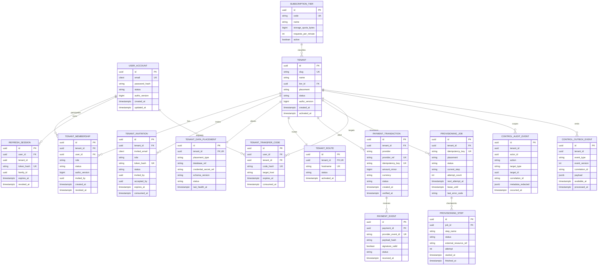
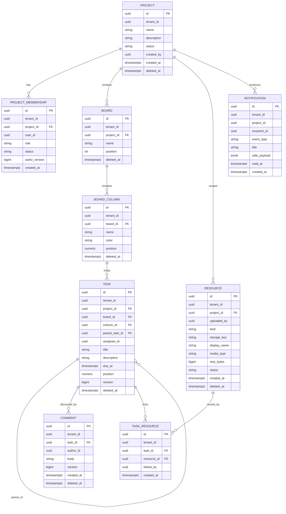
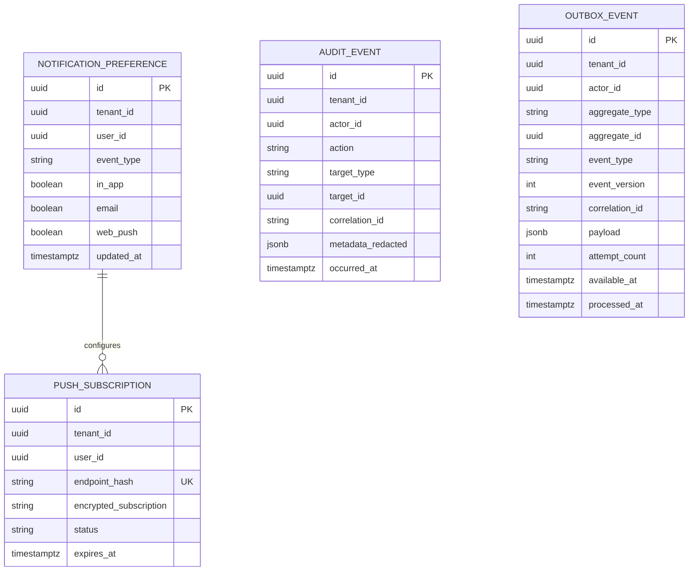
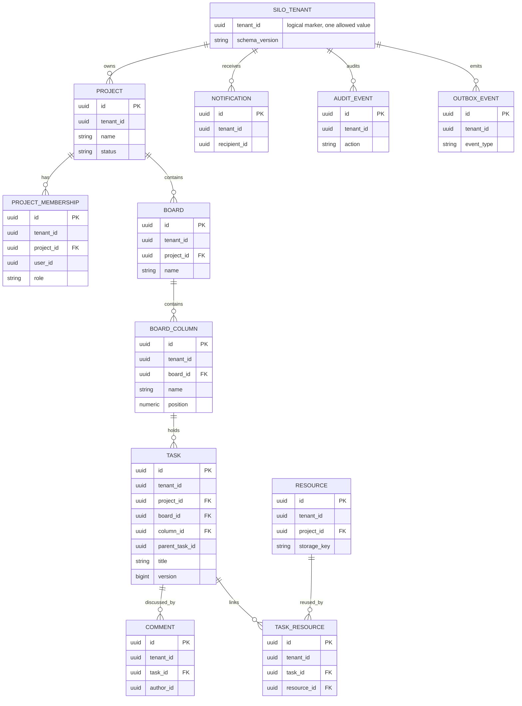

# Mô hình dữ liệu

Các kiểu dưới đây là logical types. Migration là nguồn chân lý vật lý khi implementation bắt đầu. UUID và timestamp UTC áp dụng toàn hệ thống; money dùng `amount_minor BIGINT` + `currency CHAR(3)`.

## 1. Control database ERD

Ràng buộc bổ sung:

- Unique `(tenant_id, user_id)` cho `TENANT_MEMBERSHIP`; partial/logic constraint bảo đảm đúng một active Owner.
- `placement ∈ {POOL, SILO_DATABASE}` và bất biến sau khi có application data.
- `PAYMENT_EVENT(provider_event_id)` và `PROVISIONING_JOB(idempotency_key)` chống duplicate.
- Raw callback nhạy cảm không lưu mặc định; chỉ lưu hash và metadata đã redact cần cho audit.

## 2. Pooled application database ERD

Các bảng hỗ trợ cũng thuộc cùng schema:

Pool constraints:

- Mọi unique/FK logic có tenant scope. Ưu tiên composite unique `(tenant_id, id)` và composite FK để DB từ chối liên kết cross-tenant, ngoài application checks.
- Index đọc chính bắt đầu bằng `tenant_id`, ví dụ `(tenant_id, project_id, status)` và `(tenant_id, board_id, column_id, position)`; index cuối cùng được xác nhận bằng query plan/spike.
- Nếu RLS thắng spike, policy áp dụng cho tất cả bảng tenant-scoped, kể cả join/outbox/audit/notification; app role không owner/BYPASSRLS và bật FORCE RLS.

## 3. Silo application database ERD

Mỗi Silo database dùng **chính xác cùng application migrations và logical schema** như Pool. Không tạo schema/entity riêng cho Silo; khác biệt chỉ ở datasource route và resource boundary.

Silo invariant: tất cả rows có `tenant_id` bằng tenant đã đăng ký cho database. Migration/seed tạo marker và constraint/trigger phù hợp nếu cơ chế được chọn. Điều này phát hiện route/job sai tenant thay vì dựa duy nhất vào “database riêng”.
