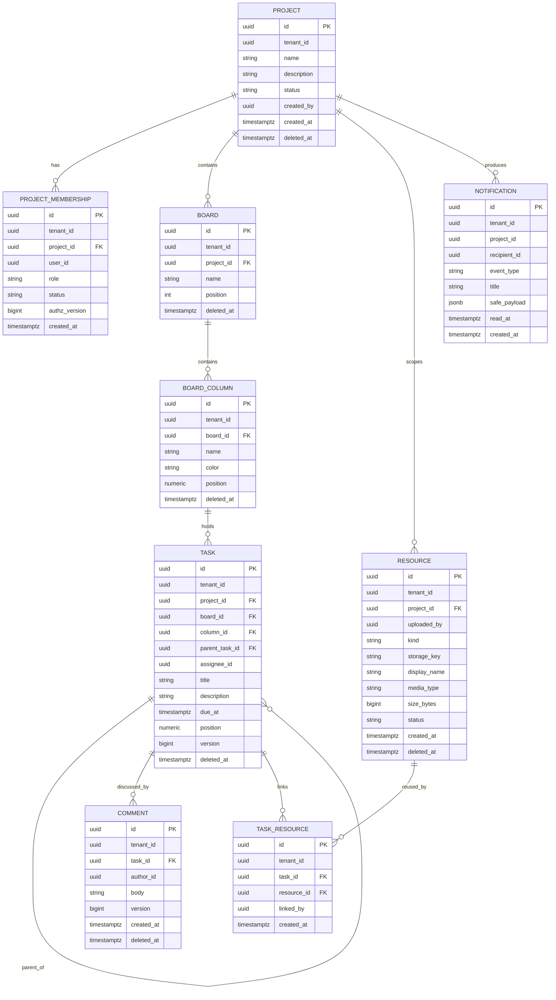
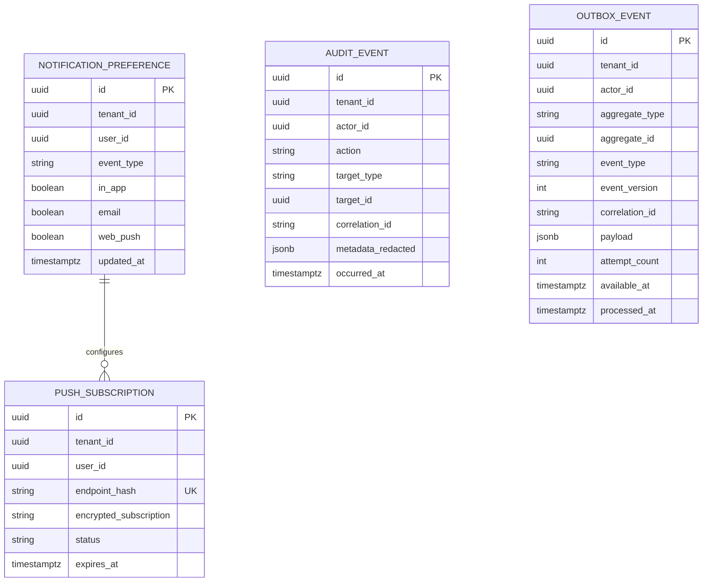
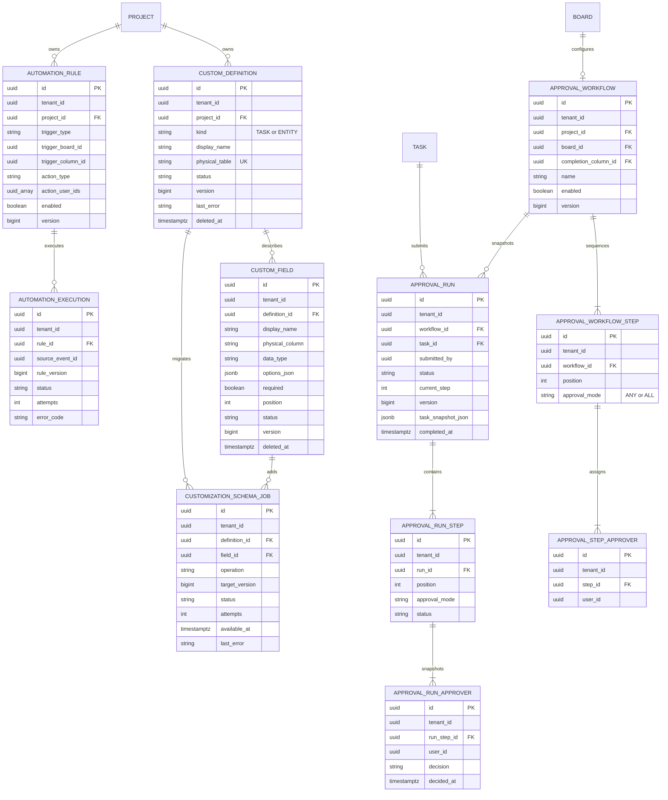
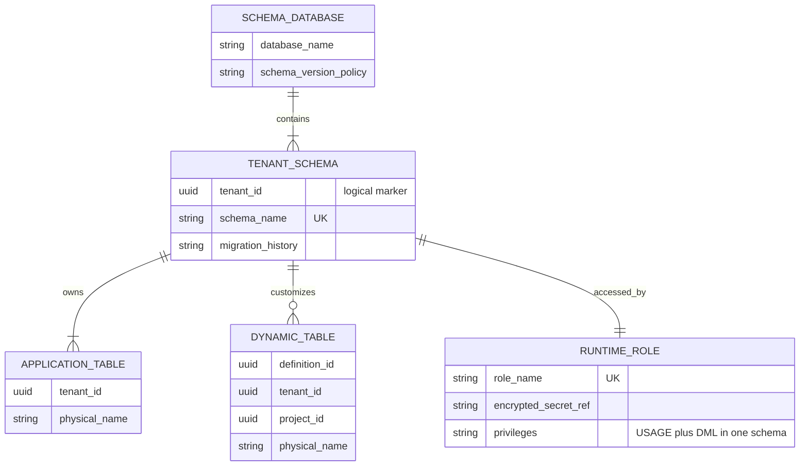
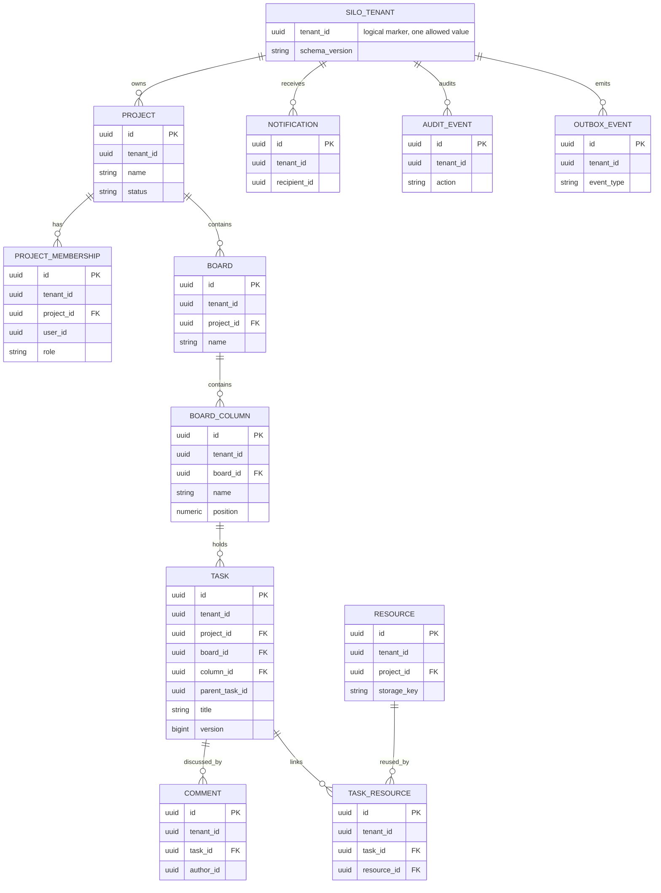

# Mô hình dữ liệu

Các kiểu dưới đây là logical types. Migration là nguồn chân lý vật lý khi implementation bắt đầu. UUID và timestamp UTC áp dụng toàn hệ thống; money dùng `amount_minor BIGINT` + `currency CHAR(3)`.

## 1. Control database ERD

```mermaid
erDiagram
    USER_ACCOUNT ||--o{ TENANT_MEMBERSHIP : participates
    SUBSCRIPTION_TIER ||--o{ TENANT : classifies
    TENANT ||--o{ TENANT_MEMBERSHIP : has
    TENANT ||--o{ TENANT_INVITATION : invites
    TENANT ||--|| TENANT_DATA_PLACEMENT : places
    TENANT ||--|| TENANT_ROUTE : routes
    TENANT ||--o{ PAYMENT_TRANSACTION : pays
    PAYMENT_TRANSACTION ||--o{ PAYMENT_EVENT : receives
    TENANT ||--o{ PROVISIONING_JOB : provisions
    PROVISIONING_JOB ||--o{ PROVISIONING_STEP : checkpoints
    USER_ACCOUNT ||--o{ REFRESH_SESSION : owns
    USER_ACCOUNT ||--o{ TENANT_TRANSFER_CODE : requests
    TENANT ||--o{ TENANT_TRANSFER_CODE : targets
    TENANT ||--o{ CONTROL_AUDIT_EVENT : scopes
    TENANT ||--o{ CONTROL_OUTBOX_EVENT : emits
    TENANT ||--o{ TENANT_CAPABILITY : grants
    TENANT ||--o| TENANT_BRANDING : brands
    TENANT ||--o{ TENANT_CONFIG_EVENT : records

    USER_ACCOUNT {
      uuid id PK
      citext email UK
      string password_hash
      string status
      bigint authz_version
      timestamptz created_at
      timestamptz updated_at
    }
    SUBSCRIPTION_TIER {
      uuid id PK
      string code UK
      string name
      bigint storage_quota_bytes
      int requests_per_minute
      boolean active
    }
    TENANT {
      uuid id PK
      string slug UK
      string name
      uuid tier_id FK
      string placement
      string status
      bigint authz_version
      timestamptz created_at
      timestamptz activated_at
    }
    TENANT_MEMBERSHIP {
      uuid id PK
      uuid tenant_id FK
      uuid user_id FK
      string role
      string status
      bigint authz_version
      uuid invited_by
      timestamptz created_at
      timestamptz revoked_at
    }
    TENANT_INVITATION {
      uuid id PK
      uuid tenant_id FK
      citext invited_email
      string role
      string token_hash UK
      string status
      uuid invited_by
      uuid accepted_by
      timestamptz expires_at
      timestamptz consumed_at
    }
    TENANT_DATA_PLACEMENT {
      uuid id PK
      uuid tenant_id FK, UK
      string placement_type
      string database_host
      int database_port
      string database_name
      string database_username
      string schema_name
      string encrypted_password
      string schema_version
      timestamptz created_at
      timestamptz updated_at
    }
    TENANT_ROUTE {
      uuid id PK
      uuid tenant_id FK, UK
      string hostname UK
      string status
      timestamptz activated_at
    }
    PAYMENT_TRANSACTION {
      uuid id PK
      uuid tenant_id FK
      string provider
      string provider_ref UK
      string idempotency_key UK
      bigint amount_minor
      string currency
      string status
      timestamptz created_at
      timestamptz verified_at
    }
    PAYMENT_EVENT {
      uuid id PK
      uuid payment_id FK
      string provider_event_id UK
      string payload_hash
      boolean signature_valid
      string status
      timestamptz received_at
    }
    PROVISIONING_JOB {
      uuid id PK
      uuid tenant_id FK
      string idempotency_key UK
      string placement
      string status
      string current_step
      int attempt_count
      timestamptz next_attempt_at
      timestamptz lease_until
      string last_error_code
    }
    PROVISIONING_STEP {
      uuid id PK
      uuid job_id FK
      string step_name
      string status
      string external_resource_ref
      int attempt
      timestamptz started_at
      timestamptz finished_at
    }
    REFRESH_SESSION {
      uuid id PK
      uuid user_id FK
      uuid tenant_id
      string token_hash UK
      uuid family_id
      timestamptz expires_at
      timestamptz revoked_at
    }
    TENANT_TRANSFER_CODE {
      uuid id PK
      uuid user_id FK
      uuid tenant_id FK
      string code_hash UK
      string target_host
      timestamptz expires_at
      timestamptz consumed_at
    }
    CONTROL_AUDIT_EVENT {
      uuid id PK
      uuid tenant_id
      uuid actor_id
      string action
      string target_type
      uuid target_id
      string correlation_id
      jsonb metadata_redacted
      timestamptz occurred_at
    }
    CONTROL_OUTBOX_EVENT {
      uuid id PK
      uuid tenant_id
      string event_type
      int event_version
      string correlation_id
      jsonb payload
      timestamptz available_at
      timestamptz processed_at
    }
    TENANT_CAPABILITY {
      uuid id PK
      uuid tenant_id FK
      string capability
      boolean granted
      boolean enabled
      bigint version
      timestamptz created_at
      timestamptz updated_at
    }
    TENANT_BRANDING {
      uuid id PK
      uuid tenant_id FK, UK
      string primary_color
      string accent_color
      string logo_storage_key
      string logo_content_type
      bigint version
      timestamptz updated_at
    }
    TENANT_CONFIG_EVENT {
      uuid id PK
      uuid tenant_id FK
      uuid actor_user_id FK
      string event_type
      text details_json
      timestamptz created_at
    }
```

Ràng buộc bổ sung:

- Unique `(tenant_id, user_id)` cho `TENANT_MEMBERSHIP`; partial/logic constraint bảo đảm đúng một active Owner.
- `placement ∈ {POOL, SCHEMA_PER_TENANT, SILO_DATABASE}` và bất biến sau khi có application data.
- `schema_name` là `public` với Pool/Silo và là tên server sinh riêng cho Schema placement; API nghiệp vụ không trả schema/credential vật lý.
- Unique `(tenant_id, capability)`; effective capability = placement hỗ trợ ∧ `granted` ∧ `enabled`. Branding được seed grant mặc định.
- `PAYMENT_EVENT(provider_event_id)` và `PROVISIONING_JOB(idempotency_key)` chống duplicate.
- Raw callback nhạy cảm không lưu mặc định; chỉ lưu hash và metadata đã redact cần cho audit.

## 2. Logical application schema dùng chung

Các bảng nghiệp vụ lõi dưới đây được tạo bởi cùng application migrations ở Pool shared schema, từng tenant schema và từng Silo database. `tenant_id` vẫn hiện diện ở cả ba placement để service/repository dùng một contract và để phát hiện route/context sai.

Các bảng hỗ trợ cũng thuộc cùng schema:

Pool shared-schema constraints:

- Mọi unique/FK logic có tenant scope. Ưu tiên composite unique `(tenant_id, id)` và composite FK để DB từ chối liên kết cross-tenant, ngoài application checks.
- Index đọc chính bắt đầu bằng `tenant_id`, ví dụ `(tenant_id, project_id, status)` và `(tenant_id, board_id, column_id, position)`; index cuối cùng được xác nhận bằng query plan/spike.
- Policy RLS áp dụng cho tất cả bảng tenant-scoped, kể cả join/outbox/audit/notification; app role không owner/BYPASSRLS và bật `FORCE ROW LEVEL SECURITY`.

## 3. Custom Data, Approval và Automation

Metadata module đi cùng application migrations. Việc bảng vật lý có mặt không tự cấp tính năng: service/worker vẫn kiểm tra placement và effective capability. `CUSTOM_DATA` chỉ có thể hiệu lực ở Schema/Silo; `APPROVALS` và `AUTOMATION` chỉ có thể hiệu lực ở Silo.

Ràng buộc chính:

- Mỗi project có tối đa một definition `TASK` đang hoạt động; entity definition có bảng riêng. Identifier vật lý `physical_table`/`physical_column` được sinh từ UUID và không dùng display name.
- Schema job unique theo tenant/definition/field/operation/version. Chỉ worker có DDL privilege; trạng thái metadata chỉ thành `ACTIVE` sau khi DDL commit.
- Bảng Task extension có khóa `(tenant_id, project_id, task_id)` liên kết task. Bảng entity động có `tenant_id`, `project_id`, `id`, `version`, audit timestamp và các cột allowlist.
- Xóa definition/field/record là xóa mềm. Migration lõi chỉ quản lý metadata/module tables và không drop bảng/cột động.
- Approval run sao chụp steps/approvers/nội dung; unique partial chỉ cho một run `PENDING` trên task. Quyết định dùng run version và chỉ update approver chưa quyết định ở current step. Run `APPROVED` chỉ cấp quyền cho snapshot chưa thay đổi; sửa nội dung được bảo vệ sau khi task rời cột hoàn thành chuyển run hiện hành sang `INVALIDATED` và buộc duyệt lại.
- Automation execution unique `(tenant_id, rule_id, source_event_id)` và lưu `rule_version`; rule không được sửa tại chỗ sau khi tạo.

## 4. Shared Database, Separate Schema

Một Schema database chứa nhiều tenant schema. Mỗi schema có trọn bộ application tables ở mục 2–3 và các bảng động của tenant đó.

Schema placement invariants:

- Schema/role do server sinh; runtime role chỉ `CONNECT`, `USAGE` và DML trên schema của mình, không có DDL hoặc quyền schema tenant khác.
- Provisioner/schema worker dùng credential tách biệt để tạo schema, migrate và cấp quyền. Flyway history nằm trong từng tenant schema.
- Transaction đặt `search_path` cục bộ vào đúng schema, nhưng isolation dựa trên database privileges, tenant guard và RLS. Truy vấn `other_schema.table` phải bị từ chối bằng privilege.
- Rollback chỉ drop schema/role khi ownership marker khớp tenant/job; lỗi một schema không thay đổi hoặc chặn tenant schema khác.

## 5. Separate Database application ERD

Mỗi Silo database dùng cùng application migrations và logical schema lõi như hai placement còn lại. Tenant Silo có thể tạo các bảng động qua Custom Data và có thể được cấp Approval/Automation; vẫn không được sửa bảng lõi hoặc triển khai mã ứng dụng riêng. Khác biệt isolation nằm ở database/credential riêng, còn API/worker/frontend vẫn dùng chung.

Silo invariant: tất cả rows có `tenant_id` bằng tenant đã đăng ký cho database. Migration/seed tạo marker và constraint/trigger phù hợp nếu cơ chế được chọn. Điều này phát hiện route/job sai tenant thay vì dựa duy nhất vào “database riêng”. Runtime role không có create/drop database/role; DDL tùy biến chỉ chạy qua worker credential và identifier allowlist.
