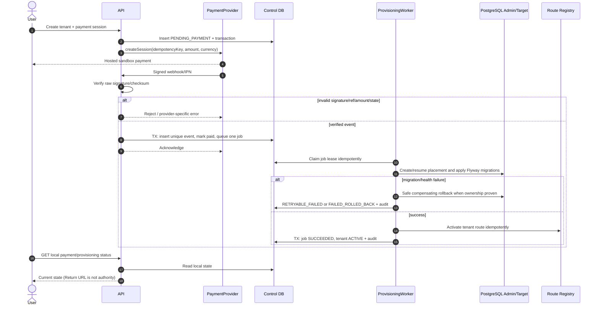
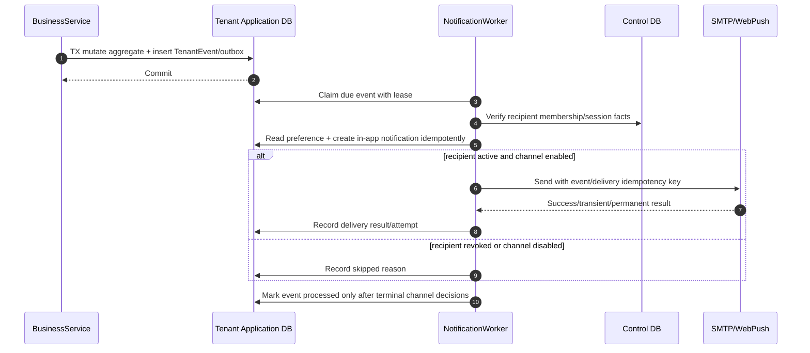
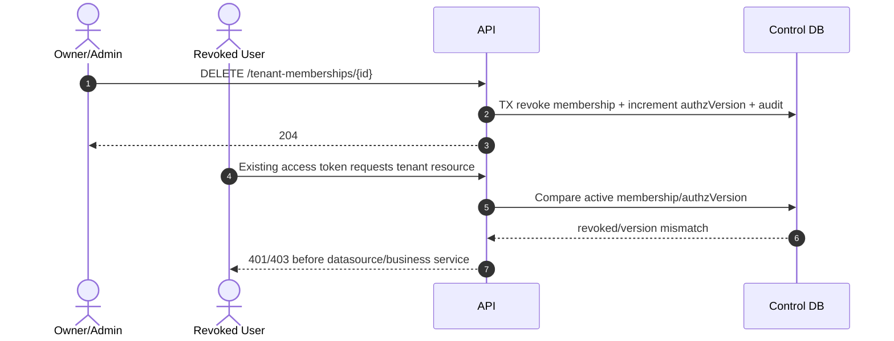

# Sequence diagrams

## 1. Đăng nhập trung tâm và đổi tenant

```mermaid
sequenceDiagram
    autonumber
    actor U as User/Browser
    participant A as Accounts Host/API
    participant C as Control DB
    participant T as Tenant Host/API

    U->>A: POST /api/v1/auth/login
    A->>C: Verify account + create central session
    C-->>A: User + active memberships
    A-->>U: Tenant choices
    U->>A: POST /api/v1/auth/tenant-transfer {tenantRef}
    A->>C: Validate ACTIVE tenant + membership + route
    A->>C: Store hashed single-use code with TTL/target host
    A-->>U: 303 https://tenant.localhost/auth/exchange?code=...
    U->>T: GET /auth/exchange?code=...
    T->>C: Atomically consume code; verify target host/membership
    C-->>T: Tenant/user/session facts
    T-->>U: Access token + host-only refresh cookie
    U->>T: GET /api/v1/projects (Bearer token)
    T->>C: Resolve host/route; check status + current membership
    alt host, tid, route and membership match
        T-->>U: Tenant-scoped response
    else any mismatch/revoke/suspend
        T-->>U: 401/403 before business service
    end
```

## 2. Payment callback và provisioning



## 3. Business request trên Pool hoặc Silo

```mermaid
sequenceDiagram
    autonumber
    actor B as Browser
    participant M as Tenant Middleware
    participant C as Control DB
    participant S as WorkService
    participant D as TenantDataSourceResolver
    participant P as Pooled DB
    participant I as Silo DB

    B->>M: PATCH /api/v1/tasks/{id} + If-Match/version
    M->>C: Host route + tenant state + current membership
    M->>M: Verify token tid; create immutable TenantContext
    M->>S: updateTask(context, id, command)
    S->>D: resolve(context.placement, context.tenantId)
    alt POOL
        D-->>S: Pooled tenant transaction
        S->>P: Set transaction tenant context if required
        S->>P: Read current ProjectMembership/action policy
        S->>P: UPDATE scoped by tenant + id + version; INSERT outbox/audit
        P-->>S: commit/new version
        S->>P: finally clear session context
    else SILO_DATABASE
        D-->>S: Tenant Silo transaction
        S->>I: Assert DB marker == context tenant
        S->>I: Read current ProjectMembership/action policy
        S->>I: UPDATE tenant + id + version; INSERT outbox/audit
        I-->>S: commit/new version
    end
    alt stale version
        S-->>B: 409 Conflict + current version metadata
    else success
        S-->>B: 200 updated task
    end
```

## 4. Upload/download resource

```mermaid
sequenceDiagram
    autonumber
    actor B as Browser
    participant API as Resource API
    participant APP as Application DB
    participant ST as ResourceStorage

    B->>API: Request upload metadata
    API->>APP: Check tenant/project role + reserve quota
    API->>ST: Create server key in tenant namespace
    ST-->>API: Short-lived upload contract
    API-->>B: Upload contract (no arbitrary key)
    B->>ST: Upload bytes
    B->>API: Finalize resource
    API->>ST: Verify object size/checksum
    API->>APP: TX finalize quota + metadata/outbox

    B->>API: GET /resources/{id}/download
    API->>APP: Resolve resource; authorize project/task in tenant
    alt authorized and object active
        API->>ST: signGet(tenantNamespace, serverKey, shortTTL)
        ST-->>API: Signed URL
        API-->>B: 302/URL response, no cache across users
    else cross-tenant/missing/revoked
        API-->>B: Deny without signed URL
    end
```

## 5. Outbox và notification



## 6. Membership revoke làm token cũ mất quyền


