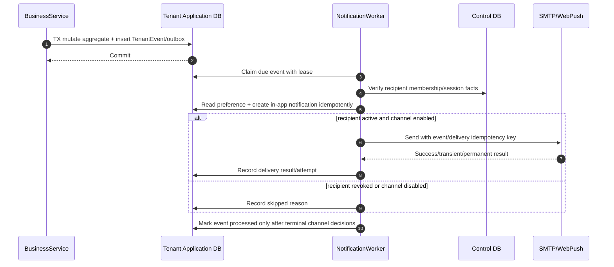
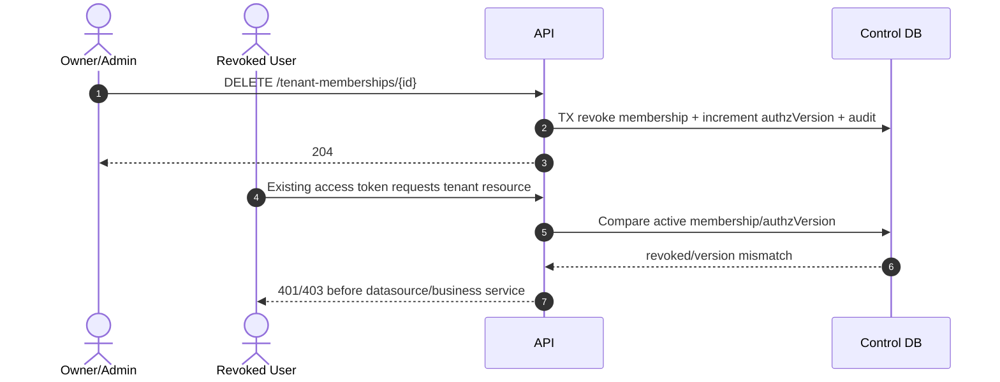
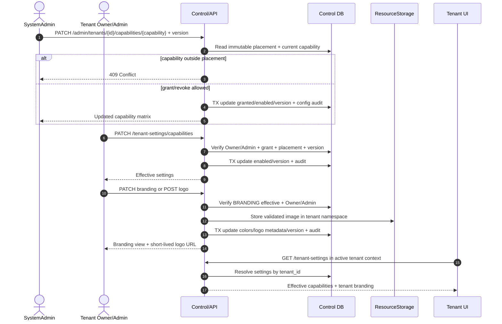

# Sequence diagrams

## 1. Đăng nhập trung tâm và đổi tenant

```mermaid
sequenceDiagram
    autonumber
    actor U as User/Browser
    participant A as Accounts Host/API
    participant C as Control DB
    participant T as Tenant Host/API

    U->>A: POST /api/v1/auth/login
    A->>C: Verify account + create central session
    C-->>A: User + active memberships
    A-->>U: Tenant choices
    U->>A: POST /api/v1/auth/tenant-transfer {tenantRef}
    A->>C: Validate ACTIVE tenant + membership + route
    A->>C: Store hashed single-use code with TTL/target host
    A-->>U: 303 https://tenant.localhost/auth/exchange?code=...
    U->>T: GET /auth/exchange?code=...
    T->>C: Atomically consume code; verify target host/membership
    C-->>T: Tenant/user/session facts
    T-->>U: Access token + host-only refresh cookie
    U->>T: GET /api/v1/projects (Bearer token)
    T->>C: Resolve host/route; check status + current membership
    alt host, tid, route and membership match
        T-->>U: Tenant-scoped response
    else any mismatch/revoke/suspend
        T-->>U: 401/403 before business service
    end
```

## 2. Payment callback và provisioning

```mermaid
sequenceDiagram
    autonumber
    actor U as User
    participant API as API
    participant PP as PaymentProvider
    participant C as Control DB
    participant W as ProvisioningWorker
    participant DB as PostgreSQL Admin/Target
    participant R as Route Registry

    U->>API: Create tenant + payment session
    API->>C: Insert PENDING_PAYMENT + transaction
    API->>PP: createSession(idempotencyKey, amount, currency)
    PP-->>U: Hosted sandbox payment
    PP->>API: Signed webhook/IPN
    API->>API: Verify raw signature/checksum
    alt invalid signature/ref/amount/state
        API-->>PP: Reject / provider-specific error
    else verified event
        API->>C: TX: insert unique event, mark paid, queue one job
        API-->>PP: Acknowledge
        W->>C: Claim job lease idempotently
        alt POOL
            W->>DB: Migrate shared public schema; register shared runtime route
        else SCHEMA_PER_TENANT
            W->>DB: Ensure shared Schema DB; create tenant role + tenant schema
            W->>DB: Flyway migrate tenant schema; grant only schema DML
        else SILO_DATABASE
            W->>DB: Create tenant DB + runtime role; Flyway migrate public schema
        end
        alt migration/health failure
            W->>DB: Safe compensating rollback for resources owned by this job
            W->>C: RETRYABLE_FAILED or FAILED_ROLLED_BACK + audit
        else success
            W->>R: Activate tenant route idempotently
            W->>C: TX: job SUCCEEDED, tenant ACTIVE + audit
        end
    end
    U->>API: GET local payment/provisioning status
    API->>C: Read local state
    API-->>U: Current state (Return URL is not authority)
```

## 3. Business request trên ba placement

```mermaid
sequenceDiagram
    autonumber
    actor B as Browser
    participant M as Tenant Middleware
    participant C as Control DB
    participant S as WorkService
    participant D as TenantDataSourceResolver
    participant P as Pool DB / shared schema
    participant H as Schema DB / tenant schema
    participant I as Silo DB

    B->>M: PATCH /api/v1/tasks/{id} + If-Match/version
    M->>C: Host route + tenant state + current membership
    M->>M: Verify token tid; create immutable TenantContext
    M->>S: updateTask(context, id, command)
    S->>D: resolve(context.placement, context.tenantId)
    alt POOL
        D-->>S: Pooled tenant transaction
        S->>P: Set transaction tenant context if required
        S->>P: Read current ProjectMembership/action policy
        S->>P: UPDATE scoped by tenant + id + version; INSERT outbox/audit
        P-->>S: commit/new version
        S->>P: Commit/rollback; transaction-local context expires
    else SCHEMA_PER_TENANT
        D-->>S: Tenant runtime datasource + verified schema
        S->>H: TX set tenant context + search_path to tenant schema
        S->>H: Read membership/action policy
        S->>H: UPDATE tenant + id + version; INSERT outbox/audit
        H-->>S: Commit/new version
        S->>H: Reused connection has no prior transaction context
    else SILO_DATABASE
        D-->>S: Tenant Silo transaction
        S->>I: Assert DB marker == context tenant
        S->>I: Read current ProjectMembership/action policy
        S->>I: UPDATE tenant + id + version; INSERT outbox/audit
        I-->>S: commit/new version
    end
    alt stale version
        S-->>B: 409 Conflict + current version metadata
    else success
        S-->>B: 200 updated task
    end
```

## 4. Upload/download resource

```mermaid
sequenceDiagram
    autonumber
    actor B as Browser
    participant API as Resource API
    participant APP as Application DB
    participant ST as ResourceStorage

    B->>API: Request upload metadata
    API->>APP: Check tenant/project role + reserve quota
    API->>ST: Create server key in tenant namespace
    ST-->>API: Short-lived upload contract
    API-->>B: Upload contract (no arbitrary key)
    B->>ST: Upload bytes
    B->>API: Finalize resource
    API->>ST: Verify object size/checksum
    API->>APP: TX finalize quota + metadata/outbox

    B->>API: GET /resources/{id}/download
    API->>APP: Resolve resource; authorize project/task in tenant
    alt authorized and object active
        API->>ST: signGet(tenantNamespace, serverKey, shortTTL)
        ST-->>API: Signed URL
        API-->>B: 302/URL response, no cache across users
    else cross-tenant/missing/revoked
        API-->>B: Deny without signed URL
    end
```

## 5. Outbox và notification



## 6. Membership revoke làm token cũ mất quyền



## 7. Cấp capability và cập nhật branding



Tắt/thu hồi Approval có thêm precondition: không còn workflow bật hoặc approval run `PENDING`. Thu hồi Custom Data/Automation không xóa metadata/history; worker kiểm lại effective capability trước xử lý lượt mới.

## 8. Custom Data: metadata → DDL job → CRUD

```mermaid
sequenceDiagram
    autonumber
    actor M as Project Manager
    actor PM as Project Member
    participant API as Custom Data API
    participant ADB as Tenant Application Schema/DB
    participant W as CustomizationSchemaWorker
    participant DDL as Provisioner DDL Connection

    M->>API: Create definition/field using display name + allowlisted type
    API->>API: Verify CUSTOM_DATA + project Manager
    API->>ADB: TX insert PENDING metadata + unique schema job + audit
    API-->>M: PENDING definition/field + job status
    W->>ADB: Claim due job FOR UPDATE SKIP LOCKED
    W->>W: Recheck tenant ACTIVE, schema version and capability
    W->>DDL: Set tenant schema; CREATE TABLE or ADD COLUMN from server IDs
    alt DDL commits
        W->>ADB: Mark metadata ACTIVE and job SUCCEEDED
    else transient/error
        W->>ADB: Store safe error; queue retry/backoff or mark FAILED
    end

    PM->>API: CRUD entity record or update Task custom values
    API->>API: Verify effective capability + project role + metadata ACTIVE
    API->>ADB: Validate field-ID map/type/required/options/version
    API->>ADB: Read/write server-generated physical table/columns
    API-->>PM: Metadata-driven record/value response
```

Đọc dữ liệu đã có vẫn được phép theo ProjectMembership sau khi `CUSTOM_DATA` bị thu hồi; mọi mutation metadata/value/record bị chặn. Xóa định nghĩa/field/record là xóa mềm, không chạy `DROP` từ request.

## 9. Phê duyệt nhiều bước

```mermaid
sequenceDiagram
    autonumber
    actor M as Project Manager
    actor U as Manager/Member submitter
    actor A as Eligible Approver
    participant API as Approval API
    participant DB as Tenant Silo DB
    participant O as Outbox

    M->>API: PUT board workflow + completion column + ordered ANY/ALL steps
    API->>DB: Verify APPROVALS, Manager, board/column and active approvers
    API->>DB: TX replace future workflow config using version + audit

    U->>API: POST task approval run
    API->>DB: Verify task role and enabled workflow
    API->>DB: Filter inactive/Viewer/submitter from each step
    alt any step has no eligible approver
        API-->>U: 409 Conflict; workflow must be corrected
    else valid snapshot
        API->>DB: TX snapshot task, steps and approvers; first step PENDING
        API->>O: APPROVAL_SUBMITTED in same transaction
    end

    A->>API: POST decision + run version
    API->>DB: Lock run; recheck current step, membership/role and undecided slot
    alt REJECTED
        API->>DB: Finish step/run REJECTED
        API->>O: APPROVAL_REJECTED
    else APPROVED and ANY/ALL not yet satisfied
        API->>DB: Record decision; increment run version
    else step satisfied but more steps remain
        API->>DB: Complete current step; activate next step; increment version
    else final step satisfied
        API->>DB: Finish run APPROVED; move task to completion column
        API->>O: APPROVAL_APPROVED
    end
```

Create/update/batch move đều gọi server guard cho cột hoàn thành. Nội dung bảo vệ chỉ sửa sau khi task rời cột hoàn thành; sửa title/description/due date/assignee/custom field làm run `PENDING` hoặc run `APPROVED` đang cấp quyền cho snapshot cũ thành `INVALIDATED`. Run đã duyệt nhưng bị invalidate không cho task quay lại cột hoàn thành; task phải gửi lại từ bước đầu. Quyết định đến sau version/trạng thái đã đổi bị từ chối.

## 10. Automation hữu hạn qua outbox

```mermaid
sequenceDiagram
    autonumber
    actor M as Project Manager
    participant API as Automation API
    participant DB as Tenant Silo DB
    participant W as OutboxWorker
    participant H as AutomationEventHandler

    M->>API: POST immutable rule (one trigger + one action)
    API->>DB: Verify AUTOMATION + Manager + board/column/recipients
    API->>DB: Insert versioned enabled rule + audit

    W->>DB: Claim TASK_CREATED/TASK_MOVED/APPROVAL_* event
    W->>H: Handle original business event
    H->>DB: Resolve task/project and matching enabled rules
    H->>DB: INSERT execution unique(tenant, rule, source_event)
    alt duplicate event/rule
        H->>DB: Keep prior terminal/running result
    else capability/rule/project/recipient invalid
        H->>DB: Mark SKIPPED or FAILED with safe error code
    else ASSIGN_USER
        H->>DB: Enforce task/approval rules; no-op if same assignee
        H->>DB: Update assignee; invalidate current approval snapshot if changed
    else NOTIFY_USERS
        H->>DB: Create idempotent in-app notification only
    end
    H->>DB: Mark execution SUCCEEDED
    W->>DB: Continue normal event delivery and mark source event processed
```

Side effect của automation không phát event được handler dùng làm trigger tiếp. Muốn đổi rule, Manager tạo rule mới và tắt rule cũ để mỗi execution giữ semantics theo `rule_version`.
