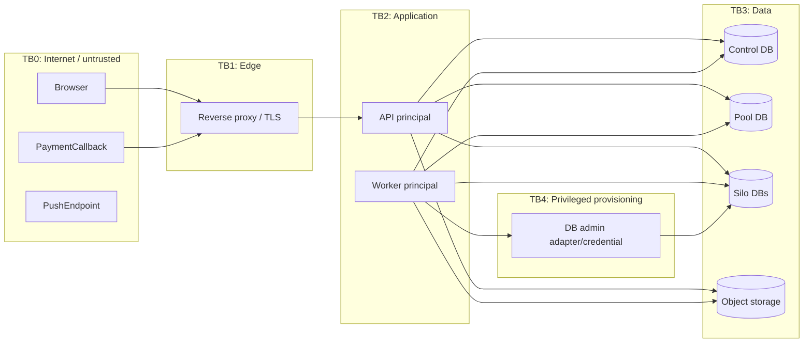

# Threat model đa thuê bao

**Phương pháp:** STRIDE kết hợp abuse-case theo tenant boundary.  
**Trạng thái:** thiết kế baseline; residual risk chỉ được đánh giá lại sau test/fault injection.

## 1. Tài sản và mục tiêu bảo vệ

- Dữ liệu project/task/comment/resource và notification của từng tenant.
- Identity, membership, role, access/refresh/transfer token.
- Payment state, provider secret và provisioning authority.
- Database credential/control route, migration integrity và backup.
- Audit/log/metric không bị sửa hoặc làm lộ dữ liệu.
- Availability công bằng giữa tenant trên compute/database dùng chung.

Mục tiêu cao nhất: một principal của tenant A không thể đọc, suy ra, ghi, xóa, tải hoặc kích hoạt side effect cho tenant B, kể cả khi biết UUID/object key/hostname của B.

## 2. Trust boundaries và entry points

Entry points: auth/login/refresh/exchange, mọi `/api/v1` business endpoint, upload/finalize/download, payment webhook/IPN/Return URL, Web Push subscription, worker job/outbox payload, admin retry/suspend, metrics/actuator và migration/backup command.

## 3. Threat register

| ID | STRIDE | Mối đe dọa / abuse case | Tác động | Kiểm soát thiết kế | Verification bắt buộc |
| --- | --- | --- | --- | --- | --- |
| T-01 | S/E | Sửa subdomain nhưng giữ token tenant A | Truy cập B | Resolve trusted Host; exact host-route-token `tid`; fail trước service | Security test host A/B matrix |
| T-02 | S/T | Giả/sửa JWT, alg/key confusion, sai issuer/audience | Mạo danh | Pin algorithm/key set, issuer/audience/exp/jti; key rotation policy | Token tamper/expired/wrong-aud tests |
| T-03 | S/R | Replay transfer code | Chiếm session tenant | Random hash-at-rest, TTL, atomic single-use, target host/user/tenant binding | Concurrent double exchange test |
| T-04 | S/E | Refresh token từ subdomain khác/CSRF | Session takeover | Host-only HttpOnly Secure rotating cookie; Origin/CSRF; family revoke | Cross-host cookie/CSRF/reuse tests |
| T-05 | E | Token còn hạn sau membership revoke/role change | Quyền cũ còn hiệu lực | Current membership+authzVersion check per request; revoke session family | Revoke then reuse old token test |
| T-06 | E | Tenant Admin tự đọc mọi project | Vi phạm privacy nội bộ | ProjectMembership riêng; policy server-side; no implicit content access | Permission matrix allow/deny tests |
| T-07 | T/I | IDOR bằng UUID task/project/comment tenant khác | Rò/ghi/xóa B | Tenant context in repository/policy; composite tenant FK; response minimization | CRUD/list/search/export cross-ID tests |
| T-08 | I | List/search/count/error làm lộ sự tồn tại tenant B | Enumeration | Scope predicate before filter/count; consistent deny/not-found policy | Search/pagination/count tests |
| T-09 | E/I | Native/bulk query bỏ tenant filter | Mass leak/corruption | Isolation mechanism + application guard; review escape hatches; tests | Native/bulk/background spike tests |
| T-10 | E | DB owner/superuser/`BYPASSRLS` vượt policy | Toàn bộ Pool lộ | App role non-owner; no BYPASSRLS; FORCE RLS; separate migration role | Role catalog assertions + owner tests |
| T-11 | T/I | Connection Pool giữ tenant session variable cũ | Request A chạy context B | Transaction-local setting where possible; reset in finally; validation query | Forced connection reuse/concurrency test |
| T-12 | T/E | Resolver nhận JDBC URL/placement từ client/control row bị sửa | Route sai Silo/SSRF DB | Opaque registry, allowlisted DB host, encrypted secret ref, placement immutable, audit | Tampered route/config tests |
| T-13 | T/E | Job/outbox payload có tenant A nhưng object thuộc B | Background cross-tenant side effect | Immutable event tenant; resolve DB from context; DB marker/assertion; recipient recheck | Wrong-tenant job injection test |
| T-14 | R/T | Duplicate/out-of-order event làm ghi lặp | Double notification/provision | Event ID/aggregate version/dedupe, legal transition, idempotent handler | Duplicate/reorder/crash-after-send tests |
| T-15 | S/T | Webhook giả hoặc sửa amount/ref/status | Free activation | Verify raw signature/checksum first; compare local amount/currency/ref; unique event | Fake/mismatch/duplicate callback tests |
| T-16 | E | Return URL trực tiếp kích hoạt success | Bypass payment | Return URL read-only; only verified server callback/query changes state | Forged Return URL test |
| T-17 | T/E | Retry provisioning tạo DB/role/route trùng | Orphan/collision | Idempotency key, deterministic resource ref, checkpoints, ownership marker | Fault at every checkpoint + retry |
| T-18 | T | Rollback xóa nhầm DB đã có dữ liệu | Mất dữ liệu | Delete only resource created by job, marker match, no user data; else manual | Adversarial rollback ownership test |
| T-19 | I | Đoán object key hoặc tái dùng signed URL | File leak | Server-generated tenant prefix; metadata authorization; short TTL; no URL logs | Cross-key, expired URL, revoke tests |
| T-20 | T/D | Upload size/type/quota race hoặc decompression payload | Storage exhaustion/malware | Reservation, max body/object, checksum/type policy, safe download headers | Parallel quota/oversize/type tests |
| T-21 | I | Notification gửi nhầm user/tenant | Data disclosure | Resolve active recipient in event tenant; minimal payload; preference; dedupe | Revoked/cross-recipient tests |
| T-22 | I | Log/metric chứa token, secret, URL hoặc task text | Secondary leak | Structured allowlist, redaction, access control, cardinality review | Log capture/secret scanning tests |
| T-23 | D | Noisy tenant cạn thread/connection/CPU | Availability tenant khác | Tenant+tier limiter, bounded queues/pools, timeout, global connection cap | Aggressor/victim before/after test |
| T-24 | D | Nhiều Silo làm cạn PostgreSQL connection | Toàn hệ thống fail | Lazy pool, ≤2 each, idle eviction, global cap, fail-fast | Pool registry saturation test |
| T-25 | E/I | Actuator/admin endpoint công khai | Control/data leak | Separate admin auth/network exposure; minimal health detail | Anonymous endpoint scan |
| T-26 | T | Migration artifact bị thay đổi/không đồng nhất Silo | Integrity/schema drift | Versioned immutable migrations, checksum validation, registry/health | Migration checksum and upgrade tests |
| T-27 | R | Audit bị sửa/xóa hoặc thiếu correlation | Không quy trách nhiệm | Append-only application path, DB permission, correlation/request ID | Privilege test + completeness checks |
| T-28 | I | Backup/test fixture chứa dữ liệu/secrets thật | Broad disclosure | Encryption/access/retention; anonymized seed; secret scanning | Backup restore + scan checklist |

## 4. Security invariants

1. Không business query khi `TenantContext` thiếu hoặc host/token/membership không khớp.
2. Không endpoint business chọn tenant từ request body/query/header tự do.
3. Không principal API có quyền tạo/drop database/role hoặc bypass isolation policy.
4. Không signed URL được tạo trước authorization metadata hiện tại.
5. Không callback browser/provider chưa verify được phép queue provisioning.
6. Không worker thực thi event nếu tenant/event/DB marker không nhất quán.
7. Không log/metric/audit chứa plaintext credential/token hoặc sensitive business payload ngoài allowlist.

## 5. Ma trận kiểm chứng theo placement

Mọi T-07..T-14, T-19, T-21 chạy ở cả Pool và Silo. Test phải bao phủ:

- hai tenant cùng user; hai tenant khác user;
- role cho phép ở A nhưng không cho phép ở B;
- UUID tồn tại, UUID không tồn tại và UUID đúng loại nhưng sai project;
- request đồng thời để buộc connection/thread reuse;
- native query, bulk update, pagination/count/search và background worker;
- tenant suspended và membership vừa revoke;
- nếu RLS: migration owner, app role, superuser/BYPASSRLS negative control.

Tiêu chí release: zero successful cross-tenant read/write/delete/download/delivery. Một trường hợp thành công loại cơ chế khỏi spike hoặc chặn release; không “bù” bằng điểm hiệu năng.

## 6. Residual risks và ngoài phạm vi

- Side-channel timing/cost ở shared compute chỉ được giảm, không chứng minh loại bỏ hoàn toàn trên một VPS.
- Silo DB không cô lập API CPU/network/object storage.
- DDoS hạ tầng quy mô Internet, supply-chain formal verification, WAF nâng cao và penetration test bên thứ ba ngoài v1.
- Endpoint support/break-glass không được triển khai trong v1; nếu bổ sung phải có ADR, approval, time-bound access và audit riêng.

