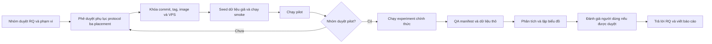

# Kịch bản triển khai nghiên cứu cho nhóm

**Trạng thái:** Bản nháp để nhóm thảo luận và phê duyệt trước khi thu số liệu chính thức  
**Phạm vi:** Ứng dụng quản lý công việc SaaS đa thuê bao với ba placement `POOL`, `SCHEMA_PER_TENANT`, `SILO_DATABASE`  
**Bản ứng dụng ứng viên hiện tại:** nhánh `an_upgrade_features`, commit `0c9d57b`  
**Lưu ý:** Commit/tag dùng cho nghiên cứu chính thức chỉ được khóa sau khi nhóm duyệt tài liệu này và phụ lục protocol.

## 1. Mục đích của tài liệu

Tài liệu này chuyển nội dung thuyết minh và protocol thành quy trình thực hiện cụ thể để cả nhóm có thể:

1. Thống nhất câu hỏi, biến đo và phạm vi trước khi chạy.
2. Dùng ứng dụng làm công cụ kiểm chứng kiến trúc, không chỉ làm sản phẩm trình diễn.
3. Phân biệt số liệu phát triển, pilot và thực nghiệm chính thức.
4. Thu đủ dữ liệu thô, manifest và bằng chứng để tái lập kết quả.
5. Tránh kết luận placement nào tốt hơn khi thiết kế thực nghiệm chưa được khóa.

Tài liệu gốc cần đọc kèm:

- [Thuyết minh đề tài](../../resource/thuyetMinhSaasMultiTenancy.md)
- [Giao thức nghiên cứu](protocol.md)
- [Hướng dẫn công cụ thực nghiệm](../../experiments/README.md)
- [Báo cáo sẵn sàng trước nghiên cứu](GROUP_READINESS_BRIEF_2026-09-18.md)
- [Khung tổng hợp và bàn giao](reporting-and-handoff.md)

## 2. Kết quả nghiên cứu cần tạo ra

Nghiên cứu gồm ba luồng bằng chứng tách biệt.

| Luồng | Nội dung | Kết quả mong đợi |
|---|---|---|
| Lý thuyết và sản phẩm | Tổng quan tài liệu, khảo sát nền tảng, xác định yêu cầu | Trả lời cơ sở cho RQ1 và một phần RQ2 |
| Kiểm chứng kỹ thuật | Cô lập tenant, phân quyền, provisioning, hiệu năng, noisy-neighbor | Bằng chứng cho RQ2, RQ3 và RQ4 |
| Đánh giá người dùng | Bộ tác vụ, thời gian hoàn thành, tỷ lệ thành công, SUS và góp ý | Đánh giá khả dụng; không thay thế kiểm chứng kiến trúc |

Ứng dụng hiện tại là **nguyên mẫu nghiên cứu hoàn thiện**. Việc còn lại không phải tiếp tục mở rộng tính năng vô hạn, mà là khóa thiết kế nghiên cứu, triển khai môi trường đo và thu bằng chứng đúng protocol.

## 3. Luồng thực hiện tổng thể



Không được đổi một lượt `development` hoặc `pilot` thành `experiment` sau khi đã nhìn thấy kết quả.

## 4. Cuộc họp phê duyệt đầu tiên

### 4.1 Các quyết định bắt buộc

Nhóm điền và ký xác nhận bảng sau trước pilot:

| Quyết định | Phương án đề xuất | Quyết định của nhóm |
|---|---|---|
| RQ | Giữ RQ1–RQ4 hiện tại |  |
| Placement chính thức | So sánh cả Pool, Schema-per-tenant và Silo |  |
| Protocol ID | `bridge-3-placement-v1` |  |
| Môi trường đo | Một VPS cố định; local chỉ dùng development/pilot |  |
| Quy mô | 3–5 tenant theo thuyết minh; 10–20 người dùng đồng thời/tenant |  |
| Kịch bản | Baseline, load, noisy-neighbor; stress là bổ sung nếu đủ thời gian |  |
| Metric | Median, p95, throughput, error rate, CPU, RAM, DB connection |  |
| Lặp | Tối thiểu 3 lần/tổ hợp scenario–placement–variant |  |
| User study | Có/không; nếu có phải duyệt đồng thuận và ẩn danh trước |  |
| Người duyệt QA | Chỉ định một thành viên không tự ý sửa dữ liệu thô |  |
| Ngày freeze | Ngày, giờ và múi giờ cụ thể |  |

### 4.2 Phụ lục protocol bắt buộc

Protocol 0.1 ban đầu đăng ký baseline Pool/Silo. So sánh chính thức cả ba placement phải có phụ lục mới, tối thiểu ghi:

- RQ và giả thuyết hoặc kỳ vọng cần kiểm tra.
- Biến độc lập: placement, mức tải và biến thể rate limit.
- Biến phụ thuộc: latency, throughput, error rate, CPU, RAM và connection.
- Biến kiểm soát: commit, image, VPS, PostgreSQL, seed, tenant count, rate, duration và warm-up.
- Điều kiện loại run được đăng ký trước.
- Số lần lặp và cách xử lý ngoại lệ.
- Cách ánh xạ tenant/host sang placement.
- Kế hoạch đạo đức và ẩn danh nếu có người tham gia.

Không sửa hồi tố protocol sau khi đã xem dữ liệu chính thức. Thay đổi cần được ghi thành phiên bản protocol mới trong `research-log.md` và `decision-log.md`.

## 5. Phân công trách nhiệm

| Vai trò | Trách nhiệm chính |
|---|---|
| Điều phối nghiên cứu | Tổ chức duyệt RQ, protocol, lịch chạy và phạm vi kết luận |
| Quản trị môi trường | VPS, domain/TLS, Docker image, cấu hình, backup và giám sát |
| Người chạy thí nghiệm | Chạy đúng lệnh và thứ tự; không tự thay workload giữa các run |
| QA dữ liệu | Kiểm tra manifest, checksum, run thiếu/lỗi và duyệt lý do loại run |
| Phân tích | Chạy công cụ phân tích, tạo bảng/biểu đồ từ dữ liệu thô bất biến |
| Phụ trách người dùng | Tuyển mẫu, đồng thuận, bộ tác vụ, SUS và ẩn danh dữ liệu |

Một người có thể giữ nhiều vai trò nếu nhóm ít thành viên. Tuy nhiên, người chạy không được tự ý xóa hoặc loại run của mình mà không có xác nhận QA.

## 6. Điều kiện trước khi chạy

### 6.1 Khóa phiên bản

1. Review nhánh `an_upgrade_features`.
2. Merge hoặc chọn commit được nhóm chấp nhận.
3. Tạo tag, ví dụ `research-v1.0`.
4. Build image API/worker/web đúng một lần cho phiên đo.
5. Ghi image digest, commit, Java, Node, PostgreSQL, k6 và Docker version.
6. Đảm bảo `git status` sạch trước mọi run `experiment`.

Không rebuild image từ source đã thay đổi giữa các placement hoặc giữa các lần lặp.

### 6.2 Khóa môi trường

Ghi vào protocol và manifest:

- Nhà cung cấp VPS và khu vực.
- Số vCPU, RAM, dung lượng/loại ổ đĩa.
- Hệ điều hành và kernel.
- PostgreSQL version và cấu hình connection pool.
- Docker/Compose version.
- Reverse proxy, TLS và rate-limit policy.
- Prometheus có hoạt động và scrape đúng khoảng thời gian run hay không.
- Các tiến trình khác cùng chạy trên VPS.

Tắt cập nhật tự động và công việc nền không liên quan trong cửa sổ đo nếu có thể. Không chạy benchmark từ chính VPS chứa ứng dụng nếu việc đó làm tranh chấp CPU/RAM; nên dùng một máy phát tải riêng và cố định.

### 6.3 Dữ liệu và tài khoản

- Chỉ dùng dữ liệu giả.
- Không đưa access token, mật khẩu hoặc credential vào Git, manifest, screenshot hay báo cáo.
- Các tenant dùng để so sánh phải có seed tương đương: số project, board, column, task, resource và thành viên.
- Tài khoản tải phải có cùng vai trò và quyền nghiệp vụ giữa các placement.
- Token chỉ được truyền qua biến môi trường của tiến trình k6.

## 7. Thiết kế tenant cho phép đo placement

### 7.1 Thiết kế được khuyến nghị

Để công cụ phân tích hiện tại có thể so sánh rõ, mỗi nhóm run chỉ nên chứa các tenant thuộc **cùng một placement**. Cần ít nhất hai tenant cho mỗi nhóm vì workload hiện tại yêu cầu tối thiểu `TENANT_A` và `TENANT_B`.

| Nhóm đo | Tenant A | Tenant B | `EXPERIMENT_ENVIRONMENT` |
|---|---|---|---|
| Pool | Hai tenant Pool có seed tương đương | Hai tenant Pool | `vps-pool` |
| Schema | Hai tenant Schema-per-tenant trong cùng DB | Hai tenant Schema | `vps-schema` |
| Silo | Hai tenant Silo có seed tương đương | Hai tenant Silo | `vps-silo` |

Nếu giữ đúng giới hạn 3–5 tenant của thuyết minh, nhóm có thể tái seed hoặc tái sử dụng tenant theo từng cửa sổ đo. Không chạy đồng thời dữ liệu dư thừa từ placement khác nếu nó làm thay đổi tài nguyên nền.

### 7.2 Điểm cần hoàn tất trước experiment

Công cụ hiện ghi tenant host và `EXPERIMENT_ENVIRONMENT`, nhưng manifest chưa có trường placement tách biệt. Trước lượt chính thức, nhóm phải chọn một trong hai cách:

1. Bổ sung placement map vào schema/manifest; đây là phương án tốt nhất.
2. Tạm thời dùng nhãn môi trường cố định `vps-pool`, `vps-schema`, `vps-silo` và ghi ánh xạ host–placement trong phụ lục protocol.

Không gộp ba placement vào cùng một run rồi dùng kết quả aggregate để kết luận placement nào nhanh hơn. Nếu muốn chạy hỗn hợp, công cụ phân tích phải được mở rộng để tổng hợp theo tag tenant/placement trước.

Runtime local hiện có ba Pool, một Schema và hai Silo. Vì vậy cần tạo thêm ít nhất một tenant Schema có seed tương đương nếu chọn thiết kế hai tenant cùng placement.

## 8. Chuẩn bị máy chạy k6

Các script `.sh` nên chạy bằng Linux, WSL hoặc Git Bash có đủ:

- `bash`
- `k6`
- Python 3
- Docker CLI nếu muốn tự thu image digest
- Kết nối tới reverse proxy và Prometheus

Ví dụ thiết lập biến môi trường; thay placeholder bằng token thật trong terminal, không lưu file theo dõi bởi Git:

```bash
export BASE_URL='https://example-research-domain.test'
export TENANT_DOMAIN='example-research-domain.test'
export TENANT_A_SLUG='pool-a'
export TENANT_A_TOKEN='<token chỉ tồn tại trong process environment>'
export TENANT_B_SLUG='pool-b'
export TENANT_B_TOKEN='<token chỉ tồn tại trong process environment>'
export EXPERIMENT_ENVIRONMENT='vps-pool'
export PROMETHEUS_URL='http://127.0.0.1:9090'
```

Kiểm tra token không xuất hiện trong lịch sử shell, log hoặc manifest sau lượt thử đầu tiên.

## 9. Chạy kiểm chứng trước pilot

### 9.1 Kiểm tra chức năng

- Đăng nhập và chọn workspace đúng host.
- Thực hiện cùng Project/Board/Task flow trên ba placement.
- Tạo thành viên, phân quyền Manager/Member/Viewer.
- Gắn cùng tài nguyên vào nhiều task.
- Tạo deadline và kiểm tra reminder/outbox/notification.
- Kiểm tra provisioning retry và idempotency.

### 9.2 Kiểm tra cô lập

Phải có bằng chứng cho các trường hợp:

- Token tenant A gửi tới host tenant B.
- Tenant A truy cập project/task/resource ID của tenant B.
- Native query và bulk update.
- Background worker/outbox.
- Với Schema-per-tenant: thử truy cập chéo bằng tên schema đầy đủ.
- Callback hoặc provisioning job bị gửi trùng.

Điều kiện loại kiến trúc/cấu hình: bất kỳ thao tác đọc, ghi hoặc xóa chéo tenant nào thành công, hoặc phép thử không có đường kiểm chứng khả thi.

## 10. Chạy pilot

Pilot dùng đúng VPS và gần giống cấu hình chính thức, nhưng không được đưa vào kết luận cuối.

```bash
RUN_CLASS=pilot scripts/run-experiment.sh smoke
RUN_CLASS=pilot scripts/run-experiment.sh baseline
RUN_CLASS=pilot scripts/run-experiment.sh load
RUN_CLASS=pilot scripts/run-experiment.sh noisy-neighbor before
RUN_CLASS=pilot scripts/run-experiment.sh noisy-neighbor after
```

Sau pilot, nhóm phải trả lời:

- Hệ thống có đạt tỷ lệ response đúng để tiếp tục không?
- Mức tải có quá nhẹ hoặc làm hệ thống sập ngay không?
- Duration có đủ để hệ thống ổn định không?
- Warm-up có cần tách riêng không?
- CPU/RAM/connection có được thu đủ không?
- Ba lần thử có biến thiên quá lớn không?
- Có rate limit hoặc tiến trình nền nào làm sai lệch không?
- Ngưỡng p95/SLO có cơ sở để khóa chưa?

Nếu điều chỉnh workload sau pilot, cập nhật protocol **trước** experiment. Không dùng số pilot làm số liệu kết luận.

## 11. Ma trận thực nghiệm chính thức

Ma trận tối thiểu đề xuất:

| Scenario | Variant | Pool | Schema | Silo | Số lần lặp |
|---|---|---:|---:|---:|---:|
| Baseline | N/A | Có | Có | Có | ≥ 3 |
| Load | N/A | Có | Có | Có | ≥ 3 |
| Noisy-neighbor | Before | Có | Có | Có | ≥ 3 |
| Noisy-neighbor | After | Có | Có | Có | ≥ 3 |
| Stress | N/A | Tùy chọn đã duyệt | Tùy chọn đã duyệt | Tùy chọn đã duyệt | ≥ 3 nếu chạy |

Không tính smoke là phép đo hiệu năng chính. Với bốn tổ hợp bắt buộc, ba placement và ba lần lặp, nhóm có **36 run chính thức**. Nếu thêm stress, tổng số là **45 run**.

### 11.1 Thứ tự chạy

Chạy xen kẽ hoặc random hóa thứ tự để giảm sai lệch theo thời gian. Ví dụ một block:

1. Pool lần 1
2. Schema lần 1
3. Silo lần 1
4. Silo lần 2
5. Pool lần 2
6. Schema lần 2
7. Schema lần 3
8. Silo lần 3
9. Pool lần 3

Giữ thời gian nghỉ cố định giữa các run và ghi vào protocol. Không chạy run tiếp theo khi CPU, connection hoặc hàng đợi từ run trước chưa trở về mức nền.

### 11.2 Lệnh mẫu

Sau khi nhóm duyệt protocol và biến môi trường của placement hiện tại:

```bash
export EXPERIMENT_PROTOCOL_ID='bridge-3-placement-v1'
export RUN_CLASS='experiment'

RUN_ID='20261001-0100Z_baseline_pool_<git-sha>' \
scripts/run-experiment.sh baseline

RUN_ID='20261001-0130Z_load_pool_<git-sha>' \
scripts/run-experiment.sh load

RUN_ID='20261001-0200Z_noisy-before_pool_<git-sha>' \
scripts/run-experiment.sh noisy-neighbor before

RUN_ID='20261001-0230Z_noisy-after_pool_<git-sha>' \
scripts/run-experiment.sh noisy-neighbor after
```

Script sẽ dừng nếu run chính thức thiếu protocol ID hoặc working tree không sạch.

## 12. Bằng chứng của mỗi run

Mỗi thư mục run phải có:

- `manifest.json`: protocol, commit, trạng thái, môi trường, tool/image và workload.
- `summary.json`: kết quả tổng hợp do k6 sinh.
- `raw-metrics.json`: từng sample đo thô.
- `resource-metrics.json`: CPU, RAM và connection theo thời gian từ Prometheus.

QA kiểm tra ngay sau từng run:

- Run kết thúc với `status=succeeded`.
- `run_class=experiment` và `eligible_for_final_analysis=true`.
- Protocol ID đúng phiên bản được duyệt.
- Commit và image digest không đổi.
- Tenant host/placement đúng nhóm đo.
- Workload đúng giá trị đã khóa.
- Timestamp hợp lệ, không trùng run ID.
- Không có token/secret trong artifact.
- Resource metrics không bị thiếu; nếu thiếu phải gắn cờ và xử lý theo quy tắc đã đăng ký.

Không sửa trực tiếp raw data. Nếu run lỗi, giữ nguyên artifact, ghi lý do và chạy một run mới với ID mới.

## 13. Phân tích

Chỉ phân tích run chính thức:

```bash
scripts/analyze-experiments.sh
```

Kết quả dự kiến:

- `observations.csv`
- `comparison.csv`
- `qa.json`
- `report.md`
- Biểu đồ SVG

Kiểm tra tối thiểu:

- Đủ số lần lặp cho từng nhóm.
- Target và workload đồng nhất.
- Không trùng run ID.
- Các run ngoại lệ được gắn cờ bằng Tukey IQR nhưng không tự động xóa.
- Mọi bảng/biểu đồ trong báo cáo có run ID hoặc đường dẫn dữ liệu nguồn.

Nên báo cáo median và p95 theo placement cùng khoảng biến thiên; không chỉ chọn run đẹp nhất. Throughput phải được đọc cùng error rate. CPU/RAM/connection phải được dùng để giải thích đánh đổi, không chỉ latency.

## 14. Kịch bản đánh giá người dùng nếu được duyệt

### 14.1 Tuyển mẫu

- Mục tiêu 30–60 người thuộc 3–5 nhóm.
- Có đồng thuận trước khi tham gia.
- Dùng mã ngẫu nhiên thay cho danh tính.
- Không thu mật khẩu, token, dữ liệu học tập thật hoặc định danh không cần thiết.
- Người tham gia có thể dừng bất cứ lúc nào.

### 14.2 Bộ tác vụ thống nhất

1. Đăng nhập và chọn đúng workspace.
2. Tạo hoặc mở một dự án.
3. Tạo task, chọn ưu tiên và deadline.
4. Giao task cho thành viên.
5. Di chuyển task trên Kanban.
6. Tạo subtask và bình luận.
7. Upload hoặc tạo link tài nguyên, sau đó gắn vào task.
8. Mở notification và đi tới đúng task.
9. Với vai trò Manager: đổi cấu trúc cột hoặc thành viên dự án.

Mỗi người nhận cùng hướng dẫn và dữ liệu khởi tạo. Không hướng dẫn thêm cho một nhóm nếu điều đó không được ghi là can thiệp nghiên cứu.

### 14.3 Dữ liệu được thu

- Hoàn thành/không hoàn thành từng tác vụ.
- Thời gian hoàn thành.
- Số lỗi hoặc lần cần hỗ trợ.
- Điểm SUS.
- Góp ý mở đã được ẩn danh.

SUS được báo cáo mô tả và không dùng làm điều kiện nghiệm thu kiến trúc. Dữ liệu người dùng phải lưu ở vị trí được nhóm phê duyệt; không commit dữ liệu còn nguy cơ tái định danh.

## 15. Cách trả lời câu hỏi nghiên cứu

Mỗi kết luận phải gắn một nhãn:

- `MEASURED`: có raw data, manifest và run ID.
- `INFERRED`: suy luận từ nhiều bằng chứng; ghi rõ điều kiện.
- `LIMITATION`: giới hạn của mẫu, môi trường hoặc công cụ.
- `PENDING_DATA`: chưa đủ dữ liệu để kết luận.

Không bắt buộc phải kết luận một placement “tốt nhất tuyệt đối”. Kết luận phù hợp hơn thường mô tả trade-off:

- Pool có thể tiết kiệm tài nguyên nhưng nhạy hơn với noisy-neighbor.
- Schema-per-tenant có biên dữ liệu rõ hơn với chi phí vận hành trung gian.
- Silo có mức cô lập mạnh nhưng có thể tốn connection, bộ nhớ và công tác provisioning hơn.
- Lựa chọn phụ thuộc yêu cầu cô lập, quy mô tenant, workload và giới hạn VPS.

Chỉ được viết các nhận định trên thành kết quả sau khi số đo của nghiên cứu xác nhận; trước đó chúng chỉ là kỳ vọng cần kiểm tra.

## 16. Lịch thực hiện đề xuất

| Mốc | Công việc | Điều kiện hoàn tất |
|---|---|---|
| Ngày 0 | Họp nhóm, duyệt RQ, placement, user study | Biên bản quyết định |
| Ngày 1–2 | Viết và duyệt phụ lục protocol | Protocol ID được khóa |
| Ngày 3–4 | Dựng VPS, TLS, monitoring, seed | Smoke và kiểm tra cô lập pass |
| Ngày 5 | Pilot | Đủ manifest/raw/resource metrics |
| Ngày 6 | Review pilot và khóa workload/SLO | Biên bản phê duyệt experiment |
| Ngày 7–10 | Chạy experiment xen kẽ | Đủ ma trận và số lần lặp |
| Ngày 11 | QA và chạy lại run lỗi hợp lệ | `qa.json` không còn lỗi chặn |
| Ngày 12–13 | Phân tích và dựng biểu đồ | Bảng/biểu đồ tái tạo được |
| Sau đó | User study nếu được duyệt | Consent và dữ liệu ẩn danh đầy đủ |
| Cuối kỳ | Trả lời RQ, báo cáo và video | Mọi kết luận có evidence ID/run ID |

Lịch trên là gợi ý và có thể thay đổi trước khi khóa protocol.

## 17. Checklist cho phép bắt đầu experiment

- [ ] Nhóm đã duyệt RQ và phạm vi ba placement.
- [ ] Có phụ lục protocol và protocol ID.
- [ ] Có người duyệt QA và quy tắc loại run.
- [ ] Commit/tag và Docker image đã khóa.
- [ ] Working tree sạch.
- [ ] VPS, domain/TLS và Prometheus hoạt động.
- [ ] Tenant/seed tương đương giữa placement.
- [ ] Có ít nhất hai tenant cho placement đang đo.
- [ ] Manifest ghi được ánh xạ tenant–placement.
- [ ] Token chỉ nằm trong process environment.
- [ ] Smoke và kiểm tra cô lập pass.
- [ ] Pilot đã được nhóm duyệt.
- [ ] Workload, duration, warm-up, rate và số lần lặp đã khóa.
- [ ] Nếu có user study, hồ sơ đồng thuận và ẩn danh đã được duyệt.

Nếu còn bất kỳ mục bắt buộc nào chưa đạt, chỉ được chạy `development` hoặc `pilot`, chưa được dùng số liệu để kết luận nghiên cứu.

